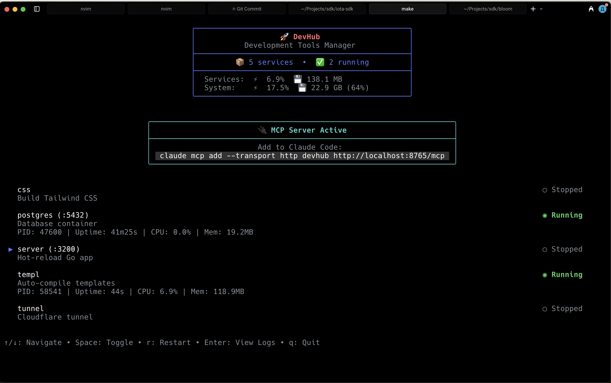

# DevHub

DevHub is a development environment orchestrator that manages all your development services from a single, beautiful terminal interface. It provides an intuitive TUI (Terminal User Interface) to start, stop, monitor, and debug your development stack including databases, web servers, build processes, and more.



## Features

- 🚀 **Service Orchestration**: Manage multiple development services with dependency resolution
- 📊 **Real-time Monitoring**: Live CPU, memory usage, and health status tracking
- 🔍 **Integrated Logging**: View, search, and follow logs from all services in one place
- 🔌 **MCP Integration**: Expose services to Claude Code and other AI tools via Model Context Protocol
- 🎯 **Dependency Management**: Automatic service startup ordering based on dependencies
- 💻 **Cross-platform**: Works on macOS, Linux, and Windows
- ⚡ **Fast & Lightweight**: Built with Go for optimal performance

## Installation

```bash
go install github.com/iota-uz/devhub/cmd/devhub@latest
```

## Quick Start

1. Create a `devhub.yml` configuration file in your project root:

```yaml
postgres:
  desc: Database container
  port: 5432
  run: docker compose -f compose.dev.yml up db
  health:
    tcp: 5432
    wait: 20s

server:
  desc: Hot-reload Go app
  port: 3200
  run: air -c .air.toml
  needs: [postgres]
  health:
    http: http://localhost:3200/health
    wait: 10s

templ:
  desc: Auto-compile templates
  run: templ generate --watch

css:
  desc: Build Tailwind CSS
  run: tailwindcss -i input.css -o output.css --watch
```

2. Start DevHub:

```bash
devhub
```

3. Use the TUI interface:
   - `↑/↓`: Navigate between services
   - `Space`: Toggle service on/off
   - `r`: Restart service
   - `Enter`: View logs
   - `q`: Quit

## Configuration

DevHub uses a YAML configuration file (default: `devhub.yml`) to define your services. Each service can specify:

### Basic Configuration

- `desc`: Human-readable description
- `port`: Port number the service runs on
- `run`: Command to execute
- `needs`: Array of service dependencies

### Health Checks

DevHub supports multiple health check types:

```yaml
# TCP health check
health:
  tcp: 5432
  timeout: 3s
  interval: 5s
  wait: 20s

# HTTP health check  
health:
  http: http://localhost:3200/health
  timeout: 3s
  interval: 5s
  wait: 10s

# Command health check
health:
  cmd: "pg_isready -h localhost -p 5432"
  timeout: 3s
  interval: 5s
  wait: 20s
```

### OS-Specific Commands

```yaml
service:
  desc: Cross-platform service
  run: my-command --flag
  os:
    windows: my-command.exe --flag
    darwin: my-command-mac --flag
```

## MCP Integration

DevHub includes a built-in Model Context Protocol (MCP) server that exposes service management tools to AI assistants like Claude Code.

### Available MCP Tools

- `list_services`: Get status of all services
- `get_logs`: Retrieve logs from a specific service (with offset support)
- `service_control`: Start, stop, or restart services
- `health_check`: Get detailed health status
- `search_logs`: Search for patterns in service logs

### Adding to Claude Code

When DevHub is running, it displays the MCP connection command in the interface:

```bash
claude mcp add --transport http devhub http://localhost:8765/mcp
```

## Command Line Options

```bash
devhub [options]

Options:
  -config string
        Path to the devhub.yml config file (default "devhub.yml")
  -mcp-port int
        Port for MCP server (default 8765)
  -version
        Show version information
```

## Service Management

### Dependencies

Services can depend on other services using the `needs` field:

```yaml
api:
  desc: API Server
  run: go run ./cmd/api
  needs: [postgres, redis]
  
postgres:
  desc: Database
  run: docker compose up postgres
  
redis:
  desc: Cache
  run: docker compose up redis
```

DevHub automatically:
- Starts dependencies before dependent services
- Waits for health checks to pass
- Stops dependents before stopping dependencies

### Health Monitoring

Health checks ensure services are ready before marking them as healthy:

- **Starting Period**: Grace period after startup before health checks begin
- **Interval**: How often to check health
- **Timeout**: Maximum time to wait for health check response
- **Retries**: Number of failed checks before marking unhealthy

## Log Management

- **Real-time Following**: Automatically scroll to new log entries
- **Search**: Find specific patterns in logs
- **Context**: View surrounding lines for search matches
- **Clearing**: Clear logs for a fresh start
- **Timestamping**: All log entries include timestamps

## Development

### Building from Source

```bash
git clone https://github.com/iota-uz/devhub.git
cd devhub
go build -o devhub ./cmd/devhub
```

### Running Tests

```bash
go test ./...
```

## Contributing

Contributions are welcome! Please feel free to submit a Pull Request. For major changes, please open an issue first to discuss what you would like to change.

## License

This project is licensed under the MIT License - see the [LICENSE](LICENSE) file for details.

## Acknowledgments

- Built with [Bubble Tea](https://github.com/charmbracelet/bubbletea) for the TUI framework
- Uses [Lip Gloss](https://github.com/charmbracelet/lipgloss) for terminal styling
- MCP integration via [mcp-go](https://github.com/mark3labs/mcp-go)
- System monitoring with [gopsutil](https://github.com/shirou/gopsutil)